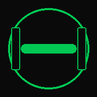

<p align="center">
  
</p>

<h1 align="center">GymFlow</h1>
<p align="center"><b>健 身 从 未 如 此 简 洁</b></p>

<p align="center">
  
  
  
  
</p>

---

## 这是什么

GymFlow 是一个**手机端 H5 健身追踪工具**，专为三分化训练设计。打开即用，数据完全保存在手机本地，不需要注册、不需要网络、不需要服务器。

适用于健身房场景——暗黑界面不刺眼，大字体高对比度，训练中单手即可操作。

## 核心功能

| 功能 | 说明 |
|------|------|
| 🔄 **自动轮转** | 推 → 拉 → 臀腿 → 休息，四天循环，打开就知道今天练什么 |
| 🔀 **200+可替换动作** | 每个肌群位置提供 2-3 个替换动作，平铺展示，自由选择 |
| ✅ **一键打卡** | 点击圆圈完成标记，进度条实时反馈，全部完成弹庆祝动画 |
| ⚖️ **体重追踪** | 记录+曲线图+BMI 自动计算，趋势一目了然 |
| 📊 **数据统计** | 累计天数、连续打卡、各部位柱状图、月度训练日历 |
| 🎯 **体态矫正** | 针对圆肩/溜肩/肱骨前移/肩峰撞击的动作要领和替换方案 |
| 🧘 **休息日计划** | 核心激活+体态矫正拉伸，不练力量也不荒废 |
| 🌓 **深浅主题** | 跟随系统自动切换，也可手动选择 |

## 快速开始

### 手机使用

从 [Releases](https://github.com/yuan201644-collab/GymFlow/releases) 下载 `健身助手.apk` 安装，或：

1. 下载 `健身助手.zip` 解压
2. 手机文件管理器找到 `index.html`
3. 浏览器打开 → 添加到主屏幕

### 电脑预览

```bash
git clone https://github.com/yuan201644-collab/GymFlow.git
cd GymFlow
# 用浏览器打开 index.html
```

## 技术栈

```
HTML5 + CSS3 + Vanilla JS
├── Chart.js       图表渲染
├── localStorage   数据持久化
├── Service Worker 离线+PWA
└── Capacitor      APK打包（可选）
```

纯前端，零依赖构建工具，一个文件夹即跑。

## 项目结构

```
GymFlow/
├── index.html          # 单页入口
├── manifest.json       # PWA 配置
├── sw.js               # 离线 Service Worker
├── css/
│   └── style.css       # 全部样式（暗黑+亮色主题）
├── js/
│   ├── app.js          # 主入口/路由/设置
│   ├── data.js         # localStorage 数据层
│   ├── training.js     # 训练计划+打卡逻辑
│   ├── weight.js       # 体重/BMI 追踪
│   ├── stats.js        # 统计图表+日历
│   └── utils.js        # 工具函数
└── icons/              # PWA 图标
```

## 截屏

> 打开 `index.html` 后用 Chrome DevTools 切换到手机视图（375×812）

---

<p align="center">
  <sub>Made with 💚  for the gym</sub>
</p>
